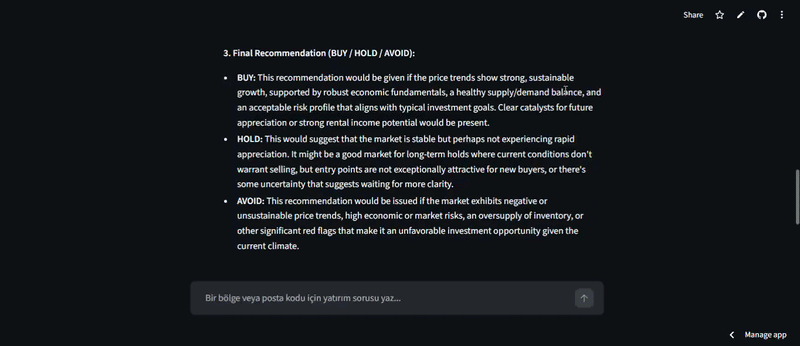

# 🏡 Real Estate Investment AI Agent

An AI-powered web application that analyzes real estate investments and provides actionable recommendations (BUY / HOLD / AVOID).

🔗 Live Demo: https://real-estate-investment-ai.streamlit.app

## 🎬 Demo

### ▶️ Full video:  
https://www.linkedin.com/posts/beyza-uzun-1520672b5_ai-machinelearning-dataanalytics-ugcPost-7455885691860938752-42vk?utm_source=share&utm_medium=member_desktop&rcm=ACoAAEumJg4BDP9c3iLiOmqBOs-X4Iyb0soZjR0
---

## 🚀 Features

- 📍 Location-based real estate analysis  
- 📊 Price trend & risk evaluation  
- 🤖 AI-powered investment recommendation  
- 🗺️ Interactive Google Maps integration  
- ☁️ BigQuery data integration  
- ⚡ Real-time AI responses with retry mechanism  

---

## 🧠 Tech Stack

- **Frontend:** Streamlit  
- **AI Model:** Google Gemini API  
- **Database:** Google BigQuery  
- **Cloud:** Google Cloud Platform  
- **Language:** Python  

---

## 🧠 How It Works

1. User enters a location (e.g., New York Manhattan)
2. Data is fetched from BigQuery
3. Gemini analyzes:
   - price trends
   - risk level
4. System generates final recommendation
5. Results are displayed with charts & map
---

## 📌 Example Usage
Analyze real estate investment in Manhattan New York and give BUY/HOLD/AVOID

---

  
## ⚠️ Notes

- AI responses may occasionally be delayed due to API load.
- Retry mechanism is implemented to handle temporary API congestion.

---

## 🎯 Project Purpose

This project demonstrates:
- AI integration into real-world applications  
- Cloud-based data pipelines  
- Building production-ready Streamlit apps  
- Handling API failures gracefully  

---

## 🙋‍♀️ Author

**Beyza Uzun**  
- LinkedIn: https://www.linkedin.com/in/beyza-uzun-1520672b5/
- GitHub: https://github.com/beyzauzun-ai  

---

